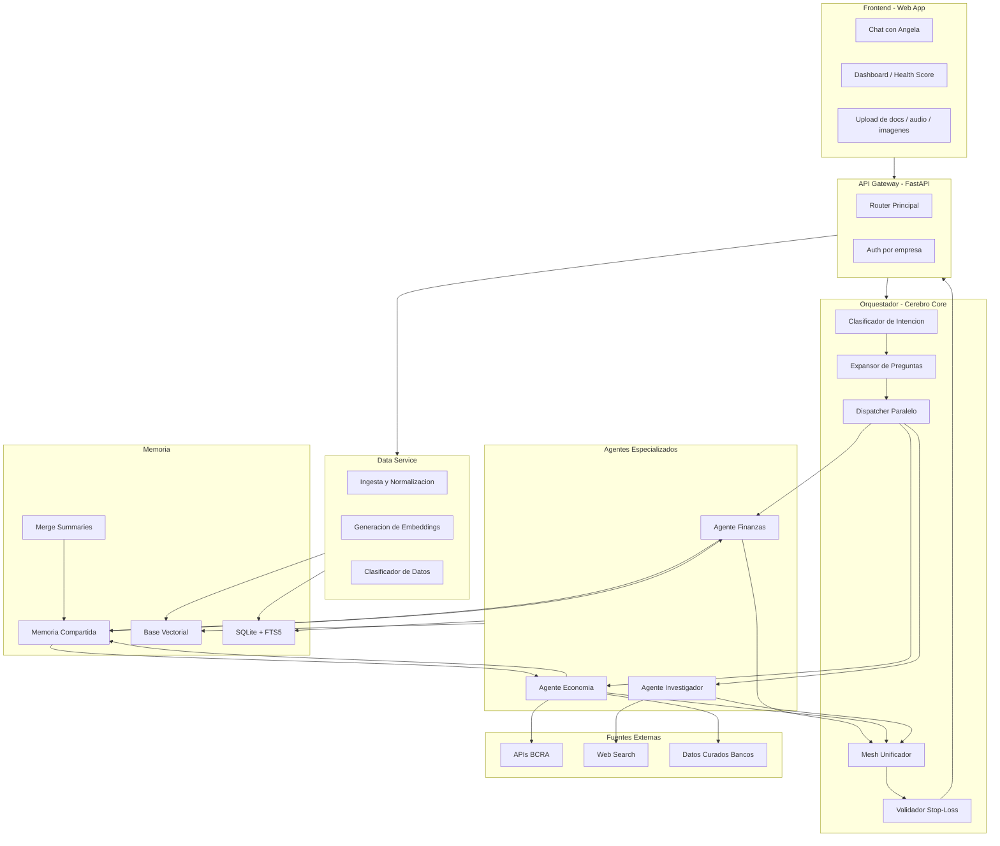
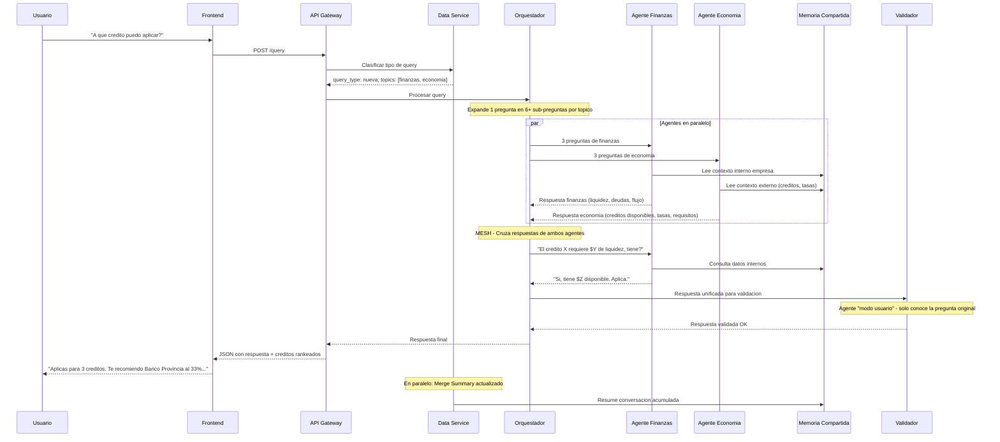
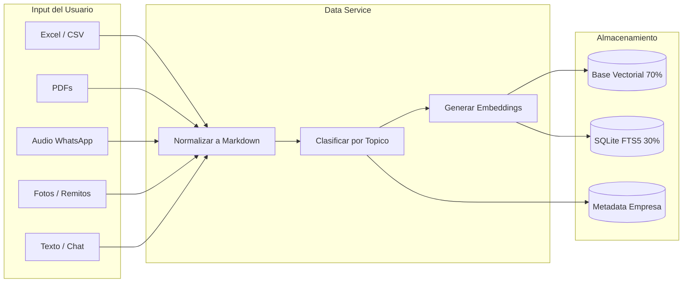

# PolPilot — El Cerebro Escalable para PyMEs

> **Angela** es la asistente de IA que vive dentro de PolPilot.
> Hackathon Anthropic — 14 de abril de 2026

---

## 1. El Problema

Las PyMEs operan a ciegas. La IA existe, pero no puede ayudarlas porque **no tiene contexto interno** de sus negocios.

- Un dueño no puede pedirle a ChatGPT que analice su empresa si la IA no tiene sus datos.
- No saben con precision la salud financiera de su negocio.
- No saben a que creditos aplican, ni que estrategias economicas les convienen.
- La informacion esta fragmentada: en la cabeza del dueno, en planillas sueltas, en WhatsApp, en papeles.
- Las corporaciones ya tienen soluciones. Las PyMEs no.
- La IA generica no entiende estacionalidad, no cruza regulaciones con caja, no compara proveedores, no anticipa oportunidades.

**Sin un cerebro interno generado desde adentro, la IA no puede comunicarse con nada de lo que hay dentro de la empresa.**

Y sin contexto externo integrado (macroeconomia, regulaciones, competencia, creditos), las decisiones se toman con informacion incompleta.

---

## 2. La Solucion: PolPilot

PolPilot es un **cerebro empresarial escalable** que:

1. **Construye contexto interno** a partir de la informacion que el lider de la empresa va cargando (datos financieros, documentos, conversaciones, audios, fotos de remitos).
2. **Busca contexto externo autonomamente** (macroeconomia, regulaciones, creditos, proveedores, competencia, estacionalidad, tendencias sectoriales).
3. **Cruza ambos contextos** para entregar estrategias, recomendaciones y analisis que un humano tardaria semanas en investigar.
4. **Se retroalimenta solo**: cuanto mas lo usa el cliente, mejor funciona. El cerebro crece y se educa con cada interaccion.
5. **Genera inteligencia intersectorial**: el conocimiento anonimizado de cada empresa enriquece a todas las demas en la red.

### Propuesta de Valor Central

**Centralizacion de contexto interno + externo + intersectorial**, fusionados en un cerebro que escala permanentemente, para que la toma de decisiones de cualquier lider PyME sea **10x mejor** que lo que puede hacer hoy solo.

### Nombre de la asistente: Angela

Angela es la interfaz conversacional — el punto de contacto entre el lider de la empresa y todo el poder del cerebro de PolPilot. "Tu socia de negocio."

---

## 3. Los Tres Pilares Conceptuales

### 3.1 Contexto Incremental Permanente

El cerebro de PolPilot es **acumulativo**. Nunca pierde informacion — la compacta, refina y conecta. Cada interaccion del usuario, cada documento cargado, cada respuesta validada ("esto me sirve / esto no") suma una capa mas de conocimiento.

**Que significa esto en la practica:**

- Dia 1: El dueno carga un Excel con ingresos y egresos. Angela entiende su flujo de caja basico.
- Dia 15: Despues de 10 conversaciones, Angela ya sabe quienes son sus clientes morosos, que proveedor es mas confiable, y que meses son flojos.
- Dia 60: Angela anticipa problemas de liquidez 3 semanas antes de que ocurran, recomienda compras estacionales, y detecta creditos para los que la empresa califica.
- Dia 180: Angela conoce el negocio mejor que cualquier consultor externo. Genera carpetas crediticias automaticas, compara proveedores en tiempo real, y notifica oportunidades de regulaciones antes de que sean publicas.

**La clave: el conocimiento es independiente del modelo de IA.** La capa de contexto (embeddings, resumenes, datos estructurados) persiste sin importar que modelo la consuma. Cuando sale Opus 5, Sonnet 4, o cualquier modelo nuevo, el cerebro se acopla sin perder nada. Solo se vuelve mas inteligente. Esto es el moat real del producto.

### 3.2 Inteligencia Intersectorial

PolPilot no es un silo por empresa. Cada empresa que usa el producto genera conocimiento que, **anonimizado y agregado**, enriquece a TODAS las demas. Es el efecto red del producto: cuantos mas clientes, mas inteligente para cada uno.

**Analogia: Waze para negocios.** Asi como Waze convierte los movimientos de millones de autos en informacion util para cada conductor, PolPilot agrega los patrones de todos sus usuarios y los convierte en senales de mercado que ningun dueno PyME podria ver solo.

**Que tipo de inteligencia se genera:**

| Dimension | Ejemplo concreto |
|-----------|-----------------|
| **Precios de proveedores** | "Tu proveedor subio 4% esta semana. El promedio del sector es 6.2%. Estas consiguiendo mejor precio que el 73% de los talleres." |
| **Morosidad por zona** | "El promedio de cobro en tu sector es 34 dias. Vos estas en 28 — mejor que el promedio." |
| **Estacionalidad cruzada** | Un patron descubierto en talleres mecanicos (pico pre-VTV en abril) puede anticipar demanda en autopartes, seguros, y servicios relacionados. |
| **Tendencias cross-sector** | "El dolar subio 2.8% — todos los importadores de autopartes, electronica y textil se ven afectados. Anticipamos ajuste de precios en 15 dias." |
| **Benchmark automatico** | "Tu margen bruto (38%) esta en el top 23% de talleres de tu tamano. El promedio es 31%." |
| **Alertas tempranas** | Si el 62% de talleres reportan retrasos de proveedores, Angela te avisa ANTES de que tu proveedor se atrase. |

**Escala del efecto:** Con 100 empresas, PolPilot tiene senales basicas. Con 1.000, puede predecir tendencias. Con 10.000, se convierte en un sistema de inteligencia de mercado sin precedentes para PyMEs.

### 3.3 Amplitud de Parametros

PolPilot no mira solo finanzas. El cerebro contempla una amplitud de parametros que ninguna herramienta PyME ofrece hoy:

| Parametro | Fuente | Uso |
|-----------|--------|-----|
| Macroeconomia | APIs BCRA, medios | Tasas, inflacion, tipo de cambio, reservas |
| Regulaciones | Boletin Oficial, BCRA, ARCA | Cambios normativos, nuevos programas, deadlines |
| Creditos disponibles | BCRA Transparencia, bancos | Lineas activas, tasas, requisitos, pre-calificacion |
| Perfil crediticio | BCRA Central Deudores | Salud crediticia por CUIT, historial 24 meses |
| Competencia | Web scraping, red PolPilot | Movimientos de competidores, precios, aperturas |
| Proveedores | Red PolPilot, datos internos | Comparacion de precios, confiabilidad, plazos |
| Estacionalidad | Datos historicos, sector | Patrones de demanda, picos, valles |
| Contexto interno | Datos cargados por el usuario | Flujo de caja, stock, clientes, empleados, procesos |

Todos estos parametros se cruzan simultaneamente. Una pregunta simple como "quiero un credito" activa la consulta de: situacion financiera interna + perfil crediticio BCRA + creditos disponibles + tasa de inflacion + estacionalidad del negocio + capacidad de repago proyectada.

---

## 4. Caso de Uso Principal (Demo Hackathon)

### Creditos PyME + Estrategia Financiera

**Una cosa, muy bien hecha.**

**Por que este caso:**
- Mercado gigante: las PyMEs necesitan creditos pero no los sacan porque no pueden.
- No saben su salud financiera real.
- No saben para que creditos aplican.
- No conocen todas las opciones (bancos, fintechs, programas subsidiados).
- La capacidad de cruzar datos internos con datos macro es inmediatamente demostrable.

**Flujo de demo (storytelling):**

1. Angela detecta que salio una nueva linea de creditos (contexto externo via BCRA).
2. Cruza automaticamente con los datos financieros de la empresa (contexto interno).
3. Le notifica al dueno: *"Hay una nueva linea de creditos del Banco Provincia al 33% TNA. Segun tus finanzas, aplicas para $4M. Con tus ingresos actuales, recuperarias la inversion en 8 meses."*
4. Muestra la **carpeta crediticia generada automaticamente** — lista para presentar al banco.
5. Si no aplica, le da una estrategia: *"Te falta liquidez para este credito. Si optimizas el cobro a Gutierrez ($340K pendientes, 47 dias), en 2 semanas podrias aplicar."*
6. Muestra la comparativa de creditos rankeados por conveniencia para ESA empresa especifica.

**Topicos activos para la demo:**

| Topico | Alcance |
|--------|---------|
| **Finanzas (Interno)** | Flujo de caja, ingresos/egresos, margenes, proyecciones, morosos, salud financiera, Health Score |
| **Economia (Externo)** | Contexto macro, creditos disponibles, tasas BCRA, regulaciones, proveedores, estacionalidad, tendencias |

---

## 5. Arquitectura del Sistema

### 5.1 Arquitectura General



### 5.2 Flujo E2E de una Query



### 5.3 Flujo de Ingesta de Datos



---

## 6. Componentes del Sistema (Detalle)

### 6.1 Orquestador — El Cerebro Innovador (Componente Core)

Este es el **diferencial principal** del producto. No es un router. Es un sistema de razonamiento multi-etapa.

**Etapa 1 — Clasificacion de intencion:**
Recibe la query del usuario. Usando el contexto del negocio (que vende, que tamano tiene, que datos cargo), entiende QUE quiere y DE QUE esta hablando.

**Etapa 2 — Expansion de preguntas (Innovacion clave):**
De una pregunta simple genera N preguntas distribuidas por topico. El usuario dice "quiero un credito" y el orquestador genera:
- Finanzas: "Cual es el flujo de caja actual?", "Cuanta liquidez hay?", "Hay deudas vigentes?", "Cual es la capacidad de repago?"
- Economia: "Que creditos estan disponibles hoy?", "Cuales son las tasas BCRA?", "Hay programas de subsidio activos?", "Cual es la inflacion proyectada?"

**Etapa 3 — Despacho paralelo a agentes:**
Cada agente recibe sus preguntas y las procesa simultaneamente contra sus fuentes de datos.

**Etapa 4 — Mesh (cruce de respuestas):**
Las respuestas de todos los agentes se unifican. Aqui es donde ocurre la magia: Economia dice "hay este credito al 29% TNA" y Finanzas dice "tiene liquidez suficiente para la primera cuota pero necesita cobrar a Gutierrez primero". El cruce genera la recomendacion integral.

**Etapa 5 — Validador Stop-Loss:**
Un agente "modo usuario" que solo conoce la pregunta original revisa la respuesta. No tiene contexto de que preguntas se hicieron internamente. Valida: "esto realmente responde lo que el usuario pidio?". Si no, vuelve a preguntar. Si si, entrega al usuario.

### 6.2 Agentes Especializados

| Agente | Rol | Modelo sugerido | Fuentes |
|--------|-----|----------------|---------|
| **Agente Finanzas** | Flujo de caja, margenes, proyecciones, salud financiera, Health Score | Opus 4.6 | Datos internos empresa (vectorizados) |
| **Agente Economia** | Creditos, tasas, regulaciones, macro, proveedores, oportunidades | Opus 4.6 | APIs BCRA + datos curados + web |
| **Agente Investigador** | Sale a buscar informacion nueva del sector, competencia, tendencias | Sonnet | Web search, noticias, APIs |
| **Agente Clasificador** | Clasifica data entrante por topico (modelo ligero) | Haiku | Input del usuario |
| **Agente Resumen** | Genera merge summaries en paralelo a la conversacion | Haiku | Historial de chat |
| **Agente Validador** | "Modo usuario" — verifica calidad antes de entregar | Sonnet | Pregunta original + respuesta |

### 6.3 Memoria Compartida

Los agentes se comunican a traves de una memoria compartida con un gateway que controla acceso:

- **Lectura**: todos los agentes pueden leer.
- **Escritura**: solo a traves del gateway (evita conflictos concurrentes).
- **Contenido**: resumen acumulado (merge summaries) + contexto del ultimo mensaje + datos estructurados de la empresa.
- **Comunicacion inter-agentes**: El agente de Economia puede preguntarle al de Finanzas "cuanto dinero hay en fondos?" sin ir al usuario. El gateway resuelve esa consulta.

### 6.4 Data Service

Microservicio responsable de todo el ciclo de vida de la informacion:

1. **Ingesta**: Recibe cualquier formato (imagen, audio, PDF, Excel, texto) y lo normaliza a Markdown.
2. **Clasificacion**: Un agente ligero (Haiku) clasifica por topico automaticamente.
3. **Embeddings**: Vectoriza para busqueda semantica.
4. **Retrieval hibrido**: 30% BM25 (SQLite FTS5) + 70% busqueda vectorial. Mejor precision que cualquiera solo.
5. **Control de memoria**: Merge summaries — genera resumenes paralelos de las conversaciones para mantener contexto sin explotar tokens.

### 6.5 Frontend (Alcance Hackathon)

Basado en lo mejor de la POC existente, pero reducido a lo esencial:

**Vista 1 — Home / Dashboard:**
- Health Score del negocio (numero unico, 0-100).
- Alertas proactivas de Angela (creditos, oportunidades, riesgos).
- Pulso semanal: metricas clave del negocio + senales del sector.
- "Lo que PolPilot genero para este negocio" — ROI cuantificado.

**Vista 2 — Chat con Angela:**
- Interfaz conversacional.
- Upload de archivos (drag & drop).
- Preguntas sugeridas contextuales.
- Respuestas con datos citados y acciones ejecutables.

**Vista 3 — Creditos y Estrategia (Demo Core):**
- Creditos disponibles rankeados por conveniencia.
- Carpeta crediticia auto-generada con "Vista Bancaria".
- Simulador: "que pasa si tomo este credito?"
- Estrategia si no aplica: "que hacer para calificar".

**Concepto rescatado de la POC — "Vista Operativa vs Vista Bancaria":**
Toggle que muestra indicadores en su valor real (operativo) vs. lo que declara ante AFIP. Muestra profundidad de entendimiento del contexto argentino.

---

## 7. Arquitectura de Datos

### Base de datos por empresa (aislamiento)

```
polpilot_db/
  empresa_{cuit}/
    knowledge.sqlite       <- Datos internos + FTS5 + vectores
    conversations.sqlite   <- Historial + merge summaries
    profile.json           <- Perfil de la empresa
```

### Stack de datos

| Componente | Tecnologia | Justificacion |
|-----------|-----------|---------------|
| Base relacional | SQLite | Sin infraestructura externa, portable, rapida |
| Full-text search | SQLite FTS5 + BM25 | 30% del retrieval hibrido |
| Base vectorial | ChromaDB o sqlite-vss | 70% del retrieval hibrido |
| Formato interno | Markdown | Mejor formato para consumo de LLMs |
| Memoria de sesion | In-memory + SQLite | Merge summaries + ultimo contexto |

### Fuentes externas reales (validadas en investigacion)

| Fuente | Metodo | Auth | Datos | Prioridad |
|--------|--------|------|-------|-----------|
| BCRA Transparencia API | REST JSON | Sin auth | Tasas por banco, condiciones. Diaria | ALTA |
| BCRA Central Deudores | REST JSON | Sin auth | Perfil crediticio por CUIT, 24 meses | ALTA |
| BCRA Variables | REST JSON | Token gratis | Tasas referencia, inflacion, dolar | MEDIA |
| Bancos (curados) | JSON manual | N/A | Lineas PyME especificas (Provincia, Galicia) | MEDIA |
| Boletin Oficial | Revision manual/scraping | N/A | Regulaciones, programas | BAJA |

---

## 8. Stack Tecnologico (PoC Hackathon)

| Capa | Tecnologia | Justificacion |
|------|-----------|---------------|
| **LLM principal** | Claude Opus 4.6 | Creditos ilimitados en hackathon. Maximo razonamiento |
| **LLM para clasificacion/resumen** | Claude Haiku | Rapido y barato para tareas de routing |
| **LLM para validacion/investigacion** | Claude Sonnet | Balance costo/calidad |
| **Backend / API Gateway** | FastAPI (Python) | Async nativo, rapido de desarrollar, tipado |
| **Base de datos** | SQLite + FTS5 | Simple, sin infra, BM25 integrado |
| **Vectores** | ChromaDB | Python-native, simple de integrar |
| **Embeddings** | Voyage AI o Anthropic | Generacion de vectores para RAG |
| **Frontend** | HTML/CSS/JS (vanilla) | Basado en POC existente. Sin frameworks innecesarios |
| **APIs externas** | BCRA (3 APIs) | Datos financieros reales, sin auth |

---

## 9. Datos para la Demo

### Empresa de ejemplo

**Gonzalo Calatayud — Frenos y Embragues** (de la POC)
- Taller mecanico especializado, Venado Tuerto, Santa Fe
- 40+ anos, 2da generacion, 8 empleados
- Facturacion ~$18M/ano, objetivo $20M
- Dos temporadas clave: VTV (mar-abr) y Cosecha gruesa (oct-nov)
- Necesita credito para crecer (elevador hidraulico)

### Datasets a generar

| Dataset | Formato | Contenido |
|---------|---------|-----------|
| Perfil de empresa | JSON | Nombre, rubro, CUIT, empleados, antiguedad, segmentos, ubicacion |
| Finanzas 12 meses | JSON | Ingresos, egresos, flujo de caja mensual, deudas, activos, morosos |
| Indicadores | JSON | Margen bruto, neto, ROA, ROE, liquidez, endeudamiento, ciclo de caja |
| Creditos disponibles | JSON | 5-8 lineas de bancos con tasas, requisitos, montos, plazos |
| Datos macro | JSON | Tasas BCRA, inflacion, dolar, programas vigentes |
| Proveedores | JSON | 3 proveedores con precios, plazos, confiabilidad |
| Clientes | JSON | Top 5 clientes con facturacion, dias de cobro, riesgo |

---

## 10. Plan de Accion Hackathon (Trazable)

### Fase 1 — Fundaciones (primeras 3 horas)

| Tarea | Responsable | Entregable |
|-------|------------|------------|
| Generar datasets de la empresa ejemplo | Equipo Datos | 7 archivos JSON |
| Disenar schema de base de datos | Equipo Dev | SQLite schema + seed script |
| Implementar API Gateway basico (FastAPI) | Equipo Dev | `/query`, `/ingest`, `/health` endpoints |
| Implementar Data Service: ingesta + normalizacion | Equipo Dev | Microservicio que recibe data y guarda |

### Fase 2 — Orquestador + Agentes (horas 3-6)

| Tarea | Responsable | Entregable |
|-------|------------|------------|
| Implementar Orquestador: clasificacion + expansion de preguntas | Equipo Dev | Orquestador que genera N sub-preguntas |
| Implementar Agente Finanzas | Equipo Dev | Agente que consulta datos internos + RAG |
| Implementar Agente Economia | Equipo Dev | Agente que consulta BCRA APIs + datos curados |
| Implementar despacho paralelo | Equipo Dev | Los 2 agentes corren en paralelo via asyncio |
| Generar embeddings de datos de la empresa | Equipo Dev | Datos vectorizados en ChromaDB |

### Fase 3 — Integracion + Memoria (horas 6-9)

| Tarea | Responsable | Entregable |
|-------|------------|------------|
| Implementar Mesh (cruce de respuestas) | Equipo Dev | Unificador que cruza finanzas + economia |
| Implementar memoria compartida | Equipo Dev | Gateway de lectura inter-agentes |
| Implementar merge summaries | Equipo Dev | Resumen paralelo de conversacion |
| Implementar Validador Stop-Loss | Equipo Dev | Agente que verifica calidad de respuesta |
| Conectar APIs BCRA reales | Equipo Dev | Datos de creditos en tiempo real |

### Fase 4 — Frontend + Demo (horas 9-12)

| Tarea | Responsable | Entregable |
|-------|------------|------------|
| Adaptar POC HTML a 3 vistas esenciales | Equipo Dev | Home + Chat + Creditos |
| Conectar frontend con backend real | Equipo Dev | Chat funcional con Angela |
| Preparar caso de uso end-to-end | Todos | Demo fluida de consulta de creditos |
| Armar slides de arquitectura (Mermaid) | Equipo Pitch | 2-3 slides con diagramas |

### Fase 5 — Pitch y Video (horas 12-14)

| Tarea | Responsable | Entregable |
|-------|------------|------------|
| Definir hook y storytelling | Equipo Pitch | Script de 2 minutos |
| Grabar video de demo | Todos | Video final |
| Review y ajustes | Todos | Version final |

---

## 11. Estructura del Pitch (2 minutos)

| Tiempo | Contenido | Que se ve |
|--------|-----------|-----------|
| **0:00 - 0:25** | **El problema.** "Hoy la IA no tiene el contexto de tu negocio. No podes pedirle que analice tu empresa si no sabe nada de ella. Las PyMEs toman decisiones a ciegas." | Texto + hook visual |
| **0:25 - 0:40** | **Que es PolPilot.** "Un cerebro que se construye desde adentro de tu empresa, sale a investigar afuera, y cruza todo para darte la mejor decision posible." | Diagrama simple del cerebro (interno + externo) |
| **0:40 - 1:30** | **Demo en vivo.** Una empresa pregunta "a que credito puedo aplicar?". Angela cruza datos internos con BCRA, devuelve creditos rankeados, genera carpeta crediticia. Mostrar el cruce real: economía dice "hay credito", finanzas dice "aplicas porque tu caja lo permite". | Pantalla del producto funcionando |
| **1:30 - 1:50** | **El como (arquitectura).** "Nuestro orquestador no solo responde — expande la pregunta, despacha agentes en paralelo, cruza sus respuestas, y valida antes de responder." | Diagrama Mermaid de arquitectura |
| **1:50 - 2:00** | **La vision.** "Cada empresa que usa PolPilot hace a todas las demas mas inteligentes. Es un cerebro que solo crece. Y se acopla a cada nuevo modelo de IA que sale." | Cierre con tagline |

### Hook del pitch

> *"Que pasaria si tu empresa tuviera un cerebro que entiende tus numeros, investiga el mercado por vos, y te dice exactamente que credito tomar y como usar esa plata? Eso es PolPilot."*

---

## 12. Diferenciadores Clave

1. **Contexto incremental permanente**: El cerebro nunca pierde informacion. Solo mejora. Es model-agnostic — se acopla a cada nueva version de IA sin perder nada.
2. **Inteligencia intersectorial**: Efecto red. Cada empresa enriquece a todas las demas con datos anonimizados. Cuantos mas clientes, mas inteligente para cada uno.
3. **Orquestador inteligente**: No es un router. Expande preguntas, despacha en paralelo, cruza respuestas entre agentes, y valida antes de responder.
4. **Amplitud de parametros**: No solo mira finanzas. Cruza macroeconomia, regulaciones, estacionalidad, competencia, proveedores, tipo de cambio, inflacion, y tendencias sectoriales.
5. **Investigacion autonoma**: Agentes que salen a buscar informacion nueva sin intervencion del usuario. Radar de senales pre-oficiales.
6. **Memoria compartida inter-agentes**: Los agentes se consultan entre si a traves de un gateway controlado. Economia le pregunta a Finanzas sin ir al usuario.
7. **Validacion pre-respuesta (Stop-Loss)**: Un agente verifica calidad y completitud antes de entregar.
8. **Zero friction**: Un audio de 12 segundos + foto de remito = 3 registros actualizados + 1 alerta de precio. Sin cargar nada en ningun sistema.
9. **Diseñado para PyMEs**: No para corporaciones. Para el segmento desatendido que mas lo necesita.

---

## 13. Vision a Futuro (Post-Hackathon)

- **Mas topicos**: Legales, Marketing, RRHH, Operaciones, Supply Chain.
- **Canales**: WhatsApp, Telegram, Slack como interfaces.
- **Onboarding automatico**: Agente que guia al usuario paso a paso para construir su cerebro (conectar Drive, Colppy, etc).
- **Vista Bancaria automatica**: Carpeta crediticia auto-generada lista para presentar al banco.
- **Health Score del sector**: Ranking anonimo de salud empresarial por industria y zona.
- **Alertas proactivas**: Angela notifica oportunidades sin que el usuario pregunte.
- **Internacionalizacion**: Creditos y oportunidades no solo argentinas sino regionales.
- **Marketplace de agentes**: Agentes especializados por industria que se instalan como plugins.
