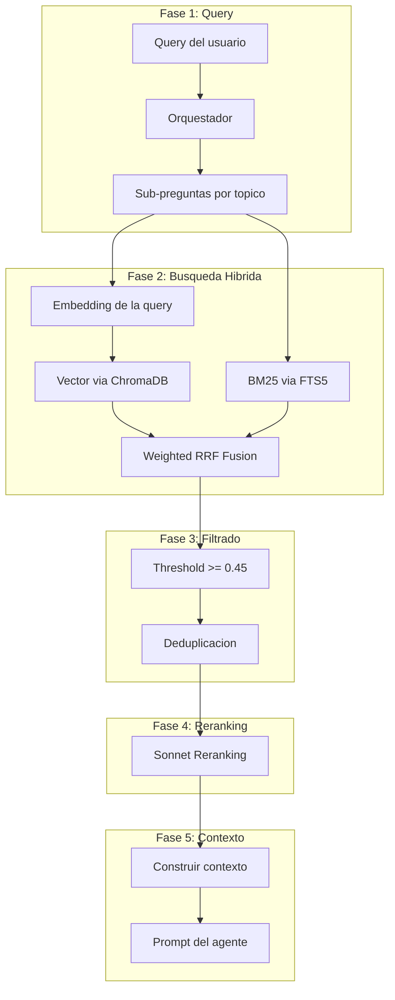
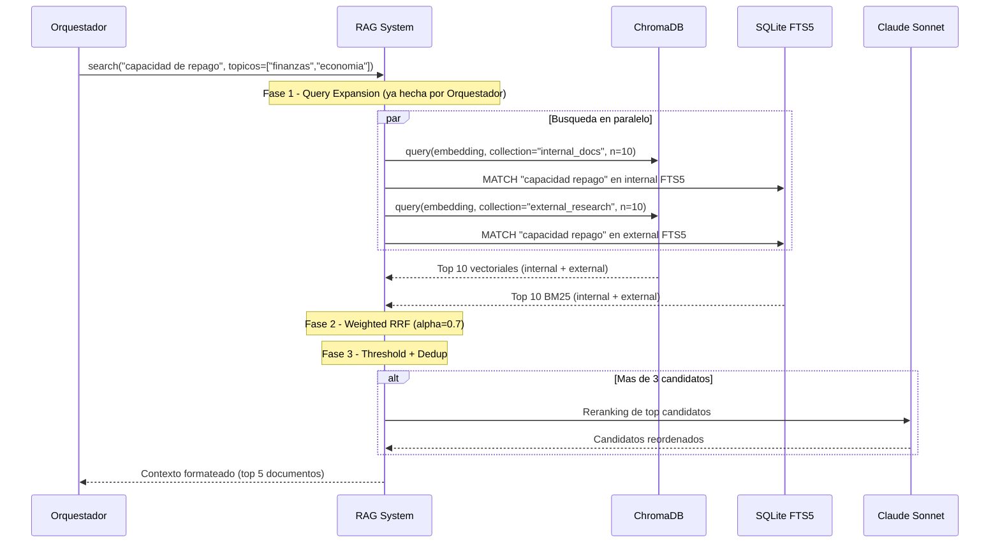
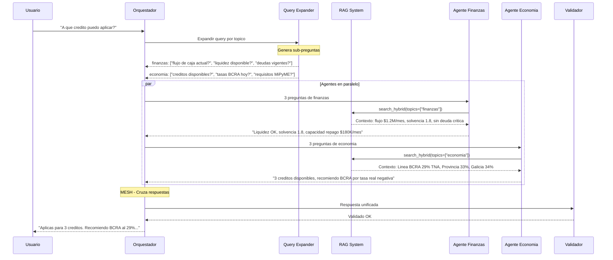

# PolPilot — Sistema de Embeddings y RAG Hibrido

> Documento de implementacion para busqueda y retrieval
> Hackathon Anthropic — 14 de abril de 2026

---

## 1. Vision General

Cuando un agente de PolPilot necesita informacion (sea el Agente Finanzas, Economia o el Orquestador), el sistema de RAG ejecuta una busqueda hibrida que combina precision lexica (BM25) con comprension semantica (vectores), fusiona los resultados y entrega el contexto mas relevante al LLM.



---

## 2. Flujo E2E de una Busqueda RAG



---

## 3. Embeddings — Generacion y Almacenamiento

### 3.1 Modelo

| Parametro | Valor |
|-----------|-------|
| Modelo | `voyage-3-lite` (rapido, eficiente) |
| Dimensiones | 512 |
| Max batch | 128 textos |
| Input types | `document` para ingesta, `query` para busqueda |
| Fallback | `text-embedding-3-small` (OpenAI, 1536 dims) |

La distincion `document` vs `query` en Voyage AI optimiza la representacion segun el caso de uso. Documentos se embedean con mayor contexto; queries con mayor precision de matching.

### 3.2 ChromaDB — 3 Collections

```python
# backend/data/vector_store.py

COLLECTIONS = {
    "internal_docs": {
        "description": "Datos internos: financials, clientes, proveedores, productos, documentos",
        "sources": ["internal.sqlite"],
    },
    "external_research": {
        "description": "Datos externos: creditos, tasas BCRA, regulaciones, senales sector",
        "sources": ["external.sqlite"],
    },
    "conversation_context": {
        "description": "Resumenes de conversaciones y hechos clave extraidos",
        "sources": ["memory.sqlite"],
    },
}
```

Cada collection usa indice HNSW con distancia coseno:

```python
import chromadb
from pathlib import Path

def get_collection(empresa_id: str, name: str) -> chromadb.Collection:
    data_dir = Path(f"data/{empresa_id}/vectors")
    data_dir.mkdir(parents=True, exist_ok=True)
    client = chromadb.PersistentClient(path=str(data_dir))
    return client.get_or_create_collection(
        name=name,
        metadata={"hnsw:space": "cosine"},
    )
```

### 3.3 UPSERT (ingesta incremental)

ChromaDB soporta upsert nativo. Si un chunk con el mismo `content_hash` ya existe, se actualiza en lugar de duplicar.

```python
def upsert_chunks(
    empresa_id: str,
    collection_name: str,
    chunks: list[dict],
    embeddings: list[list[float]],
):
    collection = get_collection(empresa_id, collection_name)

    collection.upsert(
        ids=[c["content_hash"] for c in chunks],
        documents=[c["content"] for c in chunks],
        embeddings=embeddings,
        metadatas=[
            {
                "title": c["title"],
                "topic": c["topic"],
                "source_file": c["source_file"],
                "type": c.get("type", "section"),
            }
            for c in chunks
        ],
    )
```

---

## 4. Busqueda Hibrida — BM25 + Vector + Weighted RRF

### 4.1 Arquitectura de la busqueda

La busqueda hibrida combina dos senales complementarias:

- **BM25 (30%)**: Encuentra coincidencias exactas por keywords. Ideal para terminos tecnicos como "TNA", "CUIT", nombres de bancos, montos especificos.
- **Vector (70%)**: Encuentra coincidencias semanticas. Entiende que "capacidad de repago" y "puedo pagar las cuotas" son lo mismo.
- **RRF**: Fusiona ambos rankings en uno solo, ponderado.

### 4.2 Busqueda vectorial (ChromaDB)

```python
# backend/data/vector_store.py

async def search_vector(
    empresa_id: str,
    query_embedding: list[float],
    collections: list[str],
    k: int = 10,
) -> list[dict]:
    """Busqueda vectorial en una o mas collections."""
    all_results = []

    for col_name in collections:
        collection = get_collection(empresa_id, col_name)

        results = collection.query(
            query_embeddings=[query_embedding],
            n_results=k,
            include=["documents", "metadatas", "distances"],
        )

        if results and results["ids"] and results["ids"][0]:
            for i, doc_id in enumerate(results["ids"][0]):
                distance = results["distances"][0][i]
                similarity = 1.0 - distance  # cosine distance -> similarity

                all_results.append({
                    "id": doc_id,
                    "content": results["documents"][0][i],
                    "title": results["metadatas"][0][i].get("title", ""),
                    "topic": results["metadatas"][0][i].get("topic", ""),
                    "source_file": results["metadatas"][0][i].get("source_file", ""),
                    "score_vector": similarity,
                    "source": "vector",
                    "collection": col_name,
                })

    # Ordenar por similitud descendente
    all_results.sort(key=lambda x: x["score_vector"], reverse=True)
    return all_results[:k]
```

### 4.3 Busqueda BM25 (SQLite FTS5)

```python
# backend/data/db.py

import sqlite3

def search_bm25(db_path: str, query: str, limit: int = 10) -> list[dict]:
    """Busqueda BM25 sobre la tabla FTS5."""
    conn = sqlite3.connect(db_path)

    terms = [f'"{t}"' for t in query.split() if len(t) > 2]
    fts_query = " OR ".join(terms)

    if not fts_query:
        conn.close()
        return []

    rows = conn.execute(
        """
        SELECT title, content, topic, source_file, bm25(chunks_fts) as score
        FROM chunks_fts
        WHERE chunks_fts MATCH ?
        ORDER BY score
        LIMIT ?
        """,
        (fts_query, limit),
    ).fetchall()

    conn.close()

    return [
        {
            "title": r[0],
            "content": r[1],
            "topic": r[2],
            "source_file": r[3],
            "score_bm25": abs(r[4]),  # BM25 scores en FTS5 son negativos
            "source": "bm25",
        }
        for i, r in enumerate(rows)
    ]


def search_bm25_multi_db(
    empresa_id: str,
    query: str,
    db_names: list[str],
    limit: int = 10,
) -> list[dict]:
    """Busqueda BM25 en multiples SQLite databases."""
    all_results = []
    for db_name in db_names:
        db_path = f"data/{empresa_id}/{db_name}.sqlite"
        try:
            results = search_bm25(db_path, query, limit)
            all_results.extend(results)
        except Exception:
            continue

    all_results.sort(key=lambda x: x["score_bm25"], reverse=True)
    return all_results[:limit]
```

### 4.4 Weighted Reciprocal Rank Fusion (RRF)

La formula de RRF pondera cada ranking segun su peso (alpha para vector, 1-alpha para BM25):

```
score_rrf = alpha * (1 / (k + rank_vector)) + (1 - alpha) * (1 / (k + rank_bm25))
```

Donde `k=60` es la constante RRF estandar y `alpha=0.7` da 70% de peso a vectores.

```python
# backend/data/hybrid_search.py

DEFAULT_ALPHA = 0.7   # 70% vector, 30% BM25
DEFAULT_RRF_K = 60    # Constante RRF estandar

def weighted_rrf(
    bm25_results: list[dict],
    vector_results: list[dict],
    alpha: float = DEFAULT_ALPHA,
    k: int = DEFAULT_RRF_K,
) -> list[dict]:
    """
    Reciprocal Rank Fusion ponderada.
    alpha: peso de vector (0.0-1.0). BM25 = 1 - alpha.
    k: constante de suavizado (60 es estandar).
    """
    doc_map: dict[str, dict] = {}

    # BM25 rankings
    for rank, result in enumerate(bm25_results):
        doc_key = _doc_key(result)
        if doc_key not in doc_map:
            doc_map[doc_key] = {**result, "score_rrf": 0.0, "ranks": {}}
        doc_map[doc_key]["score_rrf"] += (1 - alpha) * (1.0 / (k + rank + 1))
        doc_map[doc_key]["ranks"]["bm25"] = rank + 1

    # Vector rankings
    for rank, result in enumerate(vector_results):
        doc_key = _doc_key(result)
        if doc_key not in doc_map:
            doc_map[doc_key] = {**result, "score_rrf": 0.0, "ranks": {}}
        doc = doc_map[doc_key]
        doc["score_rrf"] += alpha * (1.0 / (k + rank + 1))
        doc["ranks"]["vector"] = rank + 1
        if "score_vector" not in doc:
            doc["score_vector"] = result.get("score_vector", 0)

    # Ordenar por score RRF descendente
    fused = sorted(doc_map.values(), key=lambda x: x["score_rrf"], reverse=True)
    return fused


def _doc_key(result: dict) -> str:
    """Clave unica para identificar documentos."""
    return result.get("id") or f"{result['title']}_{result['content'][:80]}"
```

---

## 5. Pipeline RAG Completo

### 5.1 Funcion principal de busqueda

```python
# backend/data/rag.py

from data.vector_store import search_vector, embed_single
from data.db import search_bm25_multi_db
from data.hybrid_search import weighted_rrf

SIMILARITY_THRESHOLD = 0.45
MAX_RESULTS = 5

# Mapeo topico -> collections ChromaDB + DBs SQLite
TOPIC_SEARCH_MAP = {
    "finanzas": {
        "collections": ["internal_docs"],
        "dbs": ["internal"],
    },
    "economia": {
        "collections": ["external_research"],
        "dbs": ["external"],
    },
    "all": {
        "collections": ["internal_docs", "external_research", "conversation_context"],
        "dbs": ["internal", "external"],
    },
}


async def search_hybrid(
    empresa_id: str,
    query: str,
    topics: list[str] = None,
    k: int = MAX_RESULTS,
    alpha: float = 0.7,
) -> list[dict]:
    """
    Busqueda hibrida completa: BM25 + Vector + Weighted RRF.
    Retorna top-k resultados fusionados.
    """
    if topics is None:
        topics = ["all"]

    # Determinar collections y DBs a consultar
    collections = []
    dbs = []
    for topic in topics:
        config = TOPIC_SEARCH_MAP.get(topic, TOPIC_SEARCH_MAP["all"])
        collections.extend(config["collections"])
        dbs.extend(config["dbs"])
    collections = list(set(collections))
    dbs = list(set(dbs))

    # Generar embedding de la query
    query_embedding = await embed_single(query)

    # Buscar en paralelo
    import asyncio

    vector_task = search_vector(empresa_id, query_embedding, collections, k=k * 2)
    bm25_results = search_bm25_multi_db(empresa_id, query, dbs, limit=k * 2)

    vector_results = await vector_task

    # Fusionar con Weighted RRF
    fused = weighted_rrf(bm25_results, vector_results, alpha=alpha)

    # Filtrar por threshold
    filtered = [r for r in fused if r["score_rrf"] >= _rrf_threshold(SIMILARITY_THRESHOLD)]

    # Deduplicar
    filtered = _deduplicate(filtered)

    return filtered[:k]


def _rrf_threshold(similarity_threshold: float) -> float:
    """
    Convierte un threshold de similitud a un threshold de RRF score.
    Con alpha=0.7, k=60: un doc en top-1 de ambos rankings tiene score ~0.023
    Un doc en top-10 tiene ~0.011. Usamos un threshold conservador.
    """
    return 0.005


def _deduplicate(results: list[dict]) -> list[dict]:
    """Elimina resultados con contenido duplicado."""
    seen = set()
    unique = []
    for r in results:
        key = f"{r['title']}:{r['content'][:100]}"
        if key not in seen:
            seen.add(key)
            unique.append(r)
    return unique
```

### 5.2 Busqueda multi-query (con expansion del Orquestador)

El Orquestador ya genera sub-preguntas por topico. Cada sub-pregunta se busca individualmente y los resultados se fusionan.

```python
async def search_multi_query(
    empresa_id: str,
    queries: list[dict],  # [{"query": "...", "topic": "finanzas"}, ...]
    k: int = MAX_RESULTS,
) -> list[dict]:
    """
    Busca cada sub-pregunta del Orquestador y fusiona resultados.
    queries: lista de dicts con "query" y "topic".
    """
    import asyncio

    tasks = [
        search_hybrid(
            empresa_id=empresa_id,
            query=q["query"],
            topics=[q["topic"]],
            k=k,
        )
        for q in queries
    ]

    all_result_lists = await asyncio.gather(*tasks)

    # Aplanar y deduplicar
    combined = []
    for results in all_result_lists:
        combined.extend(results)

    # Re-fusionar por RRF global (todos los rankings juntos)
    combined.sort(key=lambda x: x.get("score_rrf", 0), reverse=True)
    combined = _deduplicate(combined)

    return combined[:k]
```

---

## 6. Reranking con LLM (Opcional)

Cuando hay mas de 3 candidatos tras el filtrado, un LLM (Sonnet) los reordena por relevancia real.

### 6.1 Cuando usar reranking

| Condicion | Reranking |
|-----------|-----------|
| <= 3 candidatos | NO (retornar directo) |
| > 3 candidatos, query simple | SI |
| > 3 candidatos, query compleja | SI |
| Tiempo critico (< 500ms budget) | NO |

### 6.2 Implementacion

```python
# backend/data/reranker.py

from anthropic import Anthropic

rerank_client = Anthropic()

RERANK_MODEL = "claude-sonnet-4-20250514"
RERANK_MAX_CANDIDATES = 8
RERANK_TIMEOUT_S = 5


async def rerank_results(
    query: str,
    results: list[dict],
    max_candidates: int = RERANK_MAX_CANDIDATES,
) -> list[dict]:
    """
    Reranking con LLM: Sonnet evalua relevancia de cada candidato.
    Retorna resultados reordenados con rerank_score.
    """
    if len(results) <= 3:
        return results

    candidates = results[:max_candidates]

    # Armar prompt con candidatos
    candidates_text = ""
    for i, c in enumerate(candidates):
        snippet = c["content"][:300]
        candidates_text += f"\n[{i+1}] TITULO: {c['title']}\nCONTENIDO: {snippet}\n---"

    try:
        response = rerank_client.messages.create(
            model=RERANK_MODEL,
            max_tokens=200,
            messages=[{
                "role": "user",
                "content": (
                    "Sos un sistema de ranking de relevancia.\n"
                    f"PREGUNTA DEL USUARIO: {query}\n\n"
                    f"CANDIDATOS:{candidates_text}\n\n"
                    "Ordena los candidatos del MAS relevante al MENOS relevante "
                    "para responder la pregunta del usuario.\n\n"
                    "RESPONDER SOLO con los numeros separados por coma, "
                    "del mas relevante al menos relevante.\n"
                    "Ejemplo: 3,1,5,2,4"
                ),
            }],
        )

        order_text = response.content[0].text.strip()
        order = _parse_rerank_order(order_text, len(candidates))

        reranked = []
        for new_rank, original_idx in enumerate(order):
            result = candidates[original_idx].copy()
            result["rerank_score"] = 1.0 - (new_rank / len(order))
            reranked.append(result)

        # Agregar candidatos que no entraron al reranking
        remaining = results[max_candidates:]
        return reranked + remaining

    except Exception:
        return results  # Fallback: mantener orden original


def _parse_rerank_order(text: str, num_candidates: int) -> list[int]:
    """Parsea la respuesta del LLM a una lista de indices (0-based)."""
    import re
    numbers = re.findall(r"\d+", text)
    indices = []
    for n in numbers:
        idx = int(n) - 1  # 1-based a 0-based
        if 0 <= idx < num_candidates and idx not in indices:
            indices.append(idx)

    # Agregar indices faltantes al final
    for i in range(num_candidates):
        if i not in indices:
            indices.append(i)

    return indices
```

---

## 7. Construccion de Contexto

El contexto final se formatea como un bloque de texto estructurado que se inyecta en el prompt del agente.

```python
# backend/data/rag.py (continuacion)

def build_context(results: list[dict]) -> str:
    """
    Construye el bloque de contexto para inyectar en el prompt del agente.
    Formato optimizado para que Claude extraiga informacion con precision.
    """
    if not results:
        return ""

    parts = []
    for i, result in enumerate(results):
        score_info = f"RRF: {result.get('score_rrf', 0):.4f}"
        if result.get("rerank_score"):
            score_info += f" | Rerank: {result['rerank_score']:.2f}"

        parts.append(
            f"[FUENTE {i + 1}] ({score_info})\n"
            f"TITULO: {result['title']}\n"
            f"TOPICO: {result.get('topic', 'general')}\n"
            f"CONTENIDO:\n{result['content']}\n"
            f"---"
        )

    return "\n\n".join(parts)
```

### 7.1 Inyeccion en el prompt del agente

```python
# Ejemplo de uso en un agente (finance_agent.py)

async def run_finance_query(empresa_id: str, question: str) -> str:
    """Agente Finanzas: responde usando RAG sobre datos internos."""

    # Buscar contexto relevante
    results = await search_hybrid(
        empresa_id=empresa_id,
        query=question,
        topics=["finanzas"],
        k=5,
    )

    # Reranking si hay suficientes candidatos
    if len(results) > 3:
        results = await rerank_results(question, results)

    context = build_context(results)

    # Prompt al LLM con contexto inyectado
    response = client.messages.create(
        model="claude-sonnet-4-20250514",
        max_tokens=2048,
        system=(
            "Sos el Agente de Finanzas de PolPilot. "
            "Analizas datos internos de la empresa para responder preguntas financieras. "
            "Usa SOLO la informacion de las FUENTES proporcionadas. "
            "Si no tenes suficiente informacion, decilo claramente. "
            "Responde en espanol rioplatense profesional."
        ),
        messages=[{
            "role": "user",
            "content": (
                f"PREGUNTA: {question}\n\n"
                f"FUENTES DISPONIBLES:\n\n{context}\n\n"
                "Responder basandote en las fuentes. Citar datos especificos."
            ),
        }],
    )

    return response.content[0].text
```

---

## 8. Configuracion via Variables de Entorno

```python
# backend/config.py

import os

RAG_CONFIG = {
    # Pesos de busqueda hibrida
    "ALPHA": float(os.getenv("RAG_ALPHA", "0.7")),          # 0.7 = 70% vector
    "RRF_K": int(os.getenv("RAG_RRF_K", "60")),             # Constante RRF

    # Resultados
    "MAX_RESULTS": int(os.getenv("RAG_MAX_RESULTS", "5")),
    "SIMILARITY_THRESHOLD": float(os.getenv("RAG_THRESHOLD", "0.45")),

    # Reranking
    "RERANK_ENABLED": os.getenv("RAG_RERANK_ENABLED", "true").lower() == "true",
    "RERANK_MODEL": os.getenv("RAG_RERANK_MODEL", "claude-sonnet-4-20250514"),
    "RERANK_MAX_CANDIDATES": int(os.getenv("RAG_RERANK_MAX", "8")),

    # Embeddings
    "EMBEDDING_MODEL": os.getenv("EMBEDDING_MODEL", "voyage-3-lite"),
    "EMBEDDING_DIMENSIONS": int(os.getenv("EMBEDDING_DIMS", "512")),
}
```

### Variables de `.env`

```env
# Embeddings
VOYAGE_API_KEY=voyage-xxx
EMBEDDING_MODEL=voyage-3-lite
EMBEDDING_DIMS=512

# RAG
RAG_ALPHA=0.7
RAG_RRF_K=60
RAG_MAX_RESULTS=5
RAG_THRESHOLD=0.45
RAG_RERANK_ENABLED=true
RAG_RERANK_MODEL=claude-sonnet-4-20250514
RAG_RERANK_MAX=8
```

---

## 9. Endpoint FastAPI para Busqueda

```python
# backend/main.py (agregar)

from data.rag import search_hybrid, build_context
from data.reranker import rerank_results

@app.get("/search")
async def search_endpoint(
    empresa_id: str,
    q: str,
    topics: str = "all",        # Comma-separated: "finanzas,economia"
    k: int = 5,
    alpha: float = 0.7,
    rerank: bool = True,
):
    """Endpoint de busqueda hibrida."""
    topic_list = [t.strip() for t in topics.split(",")]

    results = await search_hybrid(
        empresa_id=empresa_id,
        query=q,
        topics=topic_list,
        k=k,
        alpha=alpha,
    )

    if rerank and len(results) > 3:
        results = await rerank_results(q, results)

    context = build_context(results)

    return {
        "query": q,
        "results": [
            {
                "title": r["title"],
                "content": r["content"][:300],
                "topic": r.get("topic"),
                "score_rrf": r.get("score_rrf", 0),
                "score_vector": r.get("score_vector", 0),
                "score_bm25": r.get("score_bm25", 0),
                "rerank_score": r.get("rerank_score"),
            }
            for r in results
        ],
        "context": context,
        "stats": {
            "total_results": len(results),
            "topics_searched": topic_list,
            "alpha": alpha,
        },
    }
```

---

## 10. Flujo Integrado con el Orquestador

Asi es como el Orquestador usa el sistema RAG en una query real del usuario:



---

## 11. Resumen de Archivos

```
polpilot/
  backend/
    data/
      rag.py              <- Busqueda hibrida + build_context (secciones 5, 7)
      hybrid_search.py     <- Weighted RRF (seccion 4.4)
      vector_store.py      <- ChromaDB wrapper (seccion 3)
      db.py                <- SQLite FTS5 busqueda BM25 (seccion 4.3)
      reranker.py          <- Reranking con Sonnet (seccion 6)
    config.py              <- Variables de configuracion (seccion 8)
    main.py                <- Endpoints /search (seccion 9)
```

### Dependencias

```
# requirements.txt (agregar a las existentes)
chromadb>=0.4
voyageai>=0.2
anthropic>=0.25
```

---

## 12. Decisiones de Diseno y Tradeoffs

| Decision | Alternativa descartada | Razon |
|----------|----------------------|-------|
| ChromaDB para vectores | SQLite + JSON (como Epsilon) | Epsilon hace full table scan en JS para cosine similarity. ChromaDB tiene indice HNSW nativo, O(log n) en vez de O(n) |
| Weighted RRF con alpha | RRF puro (sin pesos) | Epsilon tiene el parametro alpha pero no lo usa. Con pesos podemos tunear segun el tipo de query |
| Voyage AI para embeddings | OpenAI text-embedding-3-small | Voyage tiene `input_type` (document vs query) que mejora precision. Fallback a OpenAI si no hay acceso |
| Reranking con Sonnet | Sin reranking | Agrega ~1-2s de latencia pero mejora precision significativamente en queries ambiguas. Se desactiva por config |
| Ingesta incremental (UPSERT) | Clear + rebuild (como Epsilon) | Epsilon borra todo en cada ingesta. Con UPSERT solo se agregan/actualizan chunks nuevos, ahorrando tiempo y costos de API |
| FTS5 + ChromaDB separados | Todo en ChromaDB | ChromaDB no tiene BM25 nativo. FTS5 de SQLite tiene el mejor BM25 de la industria sin infraestructura adicional |
