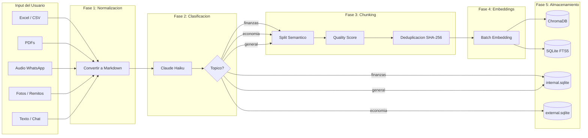

# PolPilot — Pipeline de Ingesta de Datos

> Documento de implementacion para `backend/data/data_service.py`
> Hackathon Anthropic — 14 de abril de 2026

---

## 1. Vision General

El Data Service de PolPilot recibe informacion en cualquier formato (Excel, PDF, audio, imagen, texto), la normaliza a Markdown, la clasifica por topico, la fragmenta en chunks semanticos, genera embeddings y la almacena en el sistema dual (ChromaDB + SQLite FTS5).



---

## 2. Fase 1 — Normalizacion a Markdown

Todo input se convierte a Markdown antes de cualquier procesamiento. Markdown es el formato que los LLMs consumen con mayor precision.

### 2.1 Dependencias

```
pip install pandas openpyxl pdfplumber openai-whisper anthropic
```

### 2.2 Funcion principal

```python
# backend/data/data_service.py

import hashlib
import pandas as pd
import pdfplumber
from pathlib import Path
from anthropic import Anthropic

client = Anthropic()

async def normalize_to_markdown(file_path: str, file_type: str, raw_text: str = None) -> str:
    """Convierte cualquier formato de entrada a Markdown normalizado."""

    if file_type in ("xlsx", "xls", "csv"):
        return normalize_excel(file_path)

    elif file_type == "pdf":
        return normalize_pdf(file_path)

    elif file_type in ("mp3", "ogg", "wav", "m4a", "opus"):
        return normalize_audio(file_path)

    elif file_type in ("jpg", "jpeg", "png", "webp"):
        return await normalize_image(file_path)

    elif file_type == "text" or raw_text:
        return clean_text(raw_text or Path(file_path).read_text(encoding="utf-8"))

    raise ValueError(f"Formato no soportado: {file_type}")
```

### 2.3 Excel / CSV

Convierte tablas a Markdown preservando estructura. Detecta automaticamente si hay datos financieros.

```python
def normalize_excel(file_path: str) -> str:
    ext = Path(file_path).suffix.lower()

    if ext == ".csv":
        df = pd.read_csv(file_path)
    else:
        df = pd.read_excel(file_path)

    # Eliminar filas completamente vacias
    df = df.dropna(how="all")

    # Encabezado con nombre del archivo
    filename = Path(file_path).stem
    md = f"## Datos de: {filename}\n\n"

    # Si tiene muchas columnas numericas, marcar como financiero
    numeric_cols = df.select_dtypes(include=["number"]).columns
    if len(numeric_cols) > 2:
        md += f"**Tipo**: Datos financieros ({len(df)} registros)\n\n"

    # Convertir a Markdown table
    md += df.to_markdown(index=False)

    # Agregar resumen estadistico de columnas numericas
    if len(numeric_cols) > 0:
        md += "\n\n### Resumen\n\n"
        for col in numeric_cols:
            total = df[col].sum()
            avg = df[col].mean()
            md += f"- **{col}**: Total ${total:,.0f} | Promedio ${avg:,.0f}\n"

    return md
```

### 2.4 PDF

Extrae texto de cada pagina y lo estructura como Markdown.

```python
def normalize_pdf(file_path: str) -> str:
    md_parts = []
    filename = Path(file_path).stem

    with pdfplumber.open(file_path) as pdf:
        md_parts.append(f"## Documento: {filename}\n")
        md_parts.append(f"**Paginas**: {len(pdf.pages)}\n")

        for i, page in enumerate(pdf.pages):
            text = page.extract_text()
            if text and text.strip():
                md_parts.append(f"\n### Pagina {i + 1}\n")
                md_parts.append(text.strip())

            # Extraer tablas si las hay
            tables = page.extract_tables()
            for table in tables:
                if table:
                    headers = table[0]
                    rows = table[1:]
                    df = pd.DataFrame(rows, columns=headers)
                    md_parts.append("\n" + df.to_markdown(index=False))

    return "\n\n".join(md_parts)
```

### 2.5 Audio (WhatsApp, grabaciones)

Transcribe con Whisper y estructura como Markdown.

```python
import whisper

_whisper_model = None

def get_whisper_model():
    global _whisper_model
    if _whisper_model is None:
        _whisper_model = whisper.load_model("base")
    return _whisper_model

def normalize_audio(file_path: str) -> str:
    model = get_whisper_model()
    result = model.transcribe(file_path, language="es")
    text = result["text"].strip()

    if not text:
        return ""

    filename = Path(file_path).stem
    md = f"## Audio: {filename}\n\n"
    md += f"**Transcripcion**:\n\n{text}\n"

    return md
```

### 2.6 Imagen (fotos de remitos, recibos)

Usa Claude Vision para extraer datos estructurados.

```python
import base64

async def normalize_image(file_path: str) -> str:
    with open(file_path, "rb") as f:
        image_data = base64.standard_b64encode(f.read()).decode("utf-8")

    ext = Path(file_path).suffix.lower().replace(".", "")
    media_type = f"image/{ext}" if ext != "jpg" else "image/jpeg"

    response = client.messages.create(
        model="claude-3-5-haiku-20241022",
        max_tokens=1024,
        messages=[{
            "role": "user",
            "content": [
                {
                    "type": "image",
                    "source": {
                        "type": "base64",
                        "media_type": media_type,
                        "data": image_data,
                    },
                },
                {
                    "type": "text",
                    "text": (
                        "Extraer TODA la informacion visible en esta imagen de documento comercial. "
                        "Devolver en formato Markdown con:\n"
                        "- Tipo de documento (remito, factura, recibo, etc.)\n"
                        "- Fecha\n"
                        "- Montos (todos los que aparezcan)\n"
                        "- Datos del emisor y receptor\n"
                        "- Detalle de items/conceptos\n"
                        "Solo devolver el Markdown, sin explicaciones."
                    ),
                },
            ],
        }],
    )

    filename = Path(file_path).stem
    md = f"## Documento escaneado: {filename}\n\n"
    md += response.content[0].text
    return md
```

### 2.7 Texto (chat)

Limpieza basica preservando estructura semantica.

```python
def clean_text(text: str) -> str:
    if not text or not text.strip():
        return ""

    cleaned = text.strip()

    # Normalizar saltos de linea
    cleaned = cleaned.replace("\r\n", "\n").replace("\r", "\n")

    # Colapsar 3+ saltos en 2
    import re
    cleaned = re.sub(r"\n{3,}", "\n\n", cleaned)

    # Normalizar caracteres mal codificados (comun en WhatsApp)
    replacements = {
        "\u2018": "'", "\u2019": "'",
        "\u201c": '"', "\u201d": '"',
        "\u2013": "-", "\u2014": "-",
        "\u2026": "...",
    }
    for old, new in replacements.items():
        cleaned = cleaned.replace(old, new)

    return cleaned
```

---

## 3. Fase 2 — Clasificacion por Topico

Un clasificador ligero (Haiku) determina el topico del documento para rutearlo a la base de datos correcta.

```python
VALID_TOPICS = {"finanzas", "economia", "general"}

TOPIC_TO_DB = {
    "finanzas": "internal",   # -> internal.sqlite
    "economia": "external",   # -> external.sqlite
    "general": "internal",    # -> internal.sqlite (default)
}

TOPIC_TO_COLLECTION = {
    "finanzas": "internal_docs",
    "economia": "external_research",
    "general": "internal_docs",
}

async def classify_topic(markdown_content: str) -> str:
    """Clasifica el contenido en un topico usando Haiku."""

    # Tomar solo los primeros 1500 chars para clasificacion rapida
    sample = markdown_content[:1500]

    response = client.messages.create(
        model="claude-3-5-haiku-20241022",
        max_tokens=20,
        messages=[{
            "role": "user",
            "content": (
                "Clasificar este texto en exactamente UNO de estos topicos: "
                "finanzas, economia, general.\n\n"
                "- finanzas: datos internos del negocio (ingresos, egresos, "
                "flujo de caja, clientes, proveedores, stock, empleados, facturas, remitos)\n"
                "- economia: datos externos (creditos bancarios, tasas BCRA, inflacion, "
                "regulaciones, tipo de cambio, tendencias de mercado)\n"
                "- general: todo lo demas\n\n"
                "Responder SOLO con la palabra del topico, nada mas.\n\n"
                f"TEXTO:\n{sample}"
            ),
        }],
    )

    topic = response.content[0].text.strip().lower()
    return topic if topic in VALID_TOPICS else "general"
```

---

## 4. Fase 3 — Chunking Semantico

### 4.1 Configuracion

```python
CHUNK_CONFIG = {
    "MIN": 200,       # Minimo de caracteres para un chunk viable
    "OPTIMAL": 600,   # Tamano ideal para embeddings
    "MAX": 1500,      # Maximo antes de forzar split
    "OVERLAP": 100,   # Caracteres de solapamiento entre chunks consecutivos
}

QUALITY_THRESHOLDS = {
    "MIN_WORDS": 8,
    "MIN_UNIQUE_WORDS": 5,
    "MIN_SCORE": 0.3,
}
```

### 4.2 Funcion de chunking

```python
import re

def create_semantic_chunks(
    markdown: str,
    source_filename: str,
    topic: str,
) -> list[dict]:
    """Divide Markdown en chunks semanticos respetando estructura."""

    if not markdown or len(markdown.strip()) < CHUNK_CONFIG["MIN"]:
        return []

    chunks = []

    # Separar por secciones (## headers)
    sections = re.split(r"(?=^## )", markdown, flags=re.MULTILINE)

    for section in sections:
        section = section.strip()
        if not section:
            continue

        # Extraer titulo de seccion
        title_match = re.match(r"^##\s+(.+)", section)
        title = title_match.group(1) if title_match else source_filename

        # Si la seccion entra en un solo chunk
        if len(section) <= CHUNK_CONFIG["MAX"]:
            if len(section) >= CHUNK_CONFIG["MIN"]:
                chunks.append({
                    "title": title,
                    "content": section,
                    "type": "section",
                    "source_file": source_filename,
                    "topic": topic,
                })
            continue

        # Split por parrafos para secciones grandes
        paragraphs = re.split(r"\n\s*\n", section)
        current_chunk = ""
        chunk_index = 1

        for para in paragraphs:
            para = para.strip()
            if not para:
                continue

            combined = current_chunk + "\n\n" + para if current_chunk else para

            if len(combined) > CHUNK_CONFIG["MAX"] and current_chunk:
                chunks.append({
                    "title": f"{title} (parte {chunk_index})" if chunk_index > 1 else title,
                    "content": current_chunk.strip(),
                    "type": "section_part",
                    "source_file": source_filename,
                    "topic": topic,
                })

                # Overlap: tomar los ultimos N chars del chunk anterior
                overlap_text = current_chunk[-CHUNK_CONFIG["OVERLAP"]:]
                current_chunk = overlap_text + "\n\n" + para
                chunk_index += 1

            elif len(combined) > CHUNK_CONFIG["OPTIMAL"] and _is_natural_break(para):
                chunks.append({
                    "title": f"{title} (parte {chunk_index})" if chunk_index > 1 else title,
                    "content": current_chunk.strip(),
                    "type": "section_part",
                    "source_file": source_filename,
                    "topic": topic,
                })

                overlap_text = current_chunk[-CHUNK_CONFIG["OVERLAP"]:]
                current_chunk = overlap_text + "\n\n" + para
                chunk_index += 1
            else:
                current_chunk = combined

        # Ultimo chunk
        if current_chunk.strip() and len(current_chunk.strip()) >= CHUNK_CONFIG["MIN"]:
            chunks.append({
                "title": f"{title} (parte {chunk_index})" if chunk_index > 1 else title,
                "content": current_chunk.strip(),
                "type": "section_part" if chunk_index > 1 else "section",
                "source_file": source_filename,
                "topic": topic,
            })

    return chunks


def _is_natural_break(text: str) -> bool:
    """Detecta si un parrafo es buen punto de corte."""
    return bool(
        text.rstrip().endswith(".")
        or re.match(r"^\d+\.\s+.*\.$", text)
        or len(text) < 100
    )
```

### 4.3 Deduplicacion

```python
def compute_content_hash(content: str) -> str:
    """Hash SHA-256 del contenido limpio para deduplicacion."""
    cleaned = re.sub(r"\s+", " ", content.strip().lower())
    return hashlib.sha256(cleaned.encode("utf-8")).hexdigest()[:16]


def deduplicate_chunks(
    chunks: list[dict],
    existing_hashes: set[str],
) -> list[dict]:
    """Filtra chunks duplicados. Retorna solo los nuevos."""
    unique = []
    for chunk in chunks:
        h = compute_content_hash(chunk["content"])
        if h not in existing_hashes:
            chunk["content_hash"] = h
            existing_hashes.add(h)
            unique.append(chunk)
    return unique
```

### 4.4 Quality Score

```python
def calculate_quality_score(content: str) -> float:
    """Puntaje de calidad 0.0-1.0 para un chunk."""
    score = 0.0
    words = content.lower().split()

    # Longitud adecuada
    if CHUNK_CONFIG["MIN"] <= len(content) <= CHUNK_CONFIG["MAX"]:
        score += 0.25

    # Diversidad de vocabulario
    if words:
        unique_ratio = len(set(words)) / len(words)
        score += unique_ratio * 0.25

    # Contiene datos especificos (numeros, montos, fechas)
    specific_data = re.findall(r"\$[\d.,]+|\d{1,2}/\d{1,2}/\d{2,4}|\d+%", content)
    if specific_data:
        score += min(len(specific_data) * 0.05, 0.25)

    # Contenido estructurado (listas, tablas, headers)
    if re.search(r"^\d+\.\s+", content, re.MULTILINE):
        score += 0.08
    if re.search(r"^[-*]\s+", content, re.MULTILINE):
        score += 0.07
    if re.search(r"^\|", content, re.MULTILINE):
        score += 0.10

    return min(score, 1.0)
```

---

## 5. Fase 4 — Generacion de Embeddings

### 5.1 Configuracion

```python
EMBEDDING_MODEL = "voyage-3-lite"  # Alternativa: "voyage-3" para mayor precision
EMBEDDING_DIMENSIONS = 512         # voyage-3-lite: 512, voyage-3: 1024
MAX_BATCH_SIZE = 128               # Limite de Voyage AI por batch
MAX_RETRIES = 3
BASE_DELAY_MS = 1000
```

> **Nota**: Si no se tiene acceso a Voyage AI, usar `text-embedding-3-small` de OpenAI (1536 dims) o embeddings de Anthropic cuando esten disponibles. El pipeline es agnostico al proveedor.

### 5.2 Generacion con retry

```python
import voyageai
import asyncio

voyage_client = None

def init_embeddings(api_key: str):
    global voyage_client
    voyage_client = voyageai.Client(api_key=api_key)


async def embed_texts(texts: list[str]) -> list[list[float]]:
    """Genera embeddings en batch con retry exponencial."""
    all_embeddings = []

    for i in range(0, len(texts), MAX_BATCH_SIZE):
        batch = texts[i:i + MAX_BATCH_SIZE]
        embeddings = await _embed_batch_with_retry(batch, i // MAX_BATCH_SIZE)
        all_embeddings.extend(embeddings)

    return all_embeddings


async def _embed_batch_with_retry(batch: list[str], batch_idx: int) -> list[list[float]]:
    last_error = None

    for attempt in range(MAX_RETRIES):
        try:
            result = voyage_client.embed(
                batch,
                model=EMBEDDING_MODEL,
                input_type="document",
            )
            return result.embeddings

        except Exception as e:
            last_error = e
            if attempt < MAX_RETRIES - 1:
                delay = (BASE_DELAY_MS / 1000) * (2 ** attempt)
                await asyncio.sleep(delay)

    raise RuntimeError(f"Embedding batch {batch_idx} fallo tras {MAX_RETRIES} intentos: {last_error}")


async def embed_single(text: str) -> list[float]:
    """Embedding para un texto individual (queries de busqueda)."""
    result = voyage_client.embed(
        [text],
        model=EMBEDDING_MODEL,
        input_type="query",
    )
    return result.embeddings[0]
```

### 5.3 Limpieza para embedding

El contenido que se embedea se limpia de sintaxis Markdown para que el vector capture solo semantica.

```python
def clean_for_embedding(content: str) -> str:
    """Remueve sintaxis Markdown para mejor representacion vectorial."""
    text = content
    text = re.sub(r"^#{1,6}\s+", "", text, flags=re.MULTILINE)
    text = re.sub(r"\*\*([^*]+)\*\*", r"\1", text)
    text = re.sub(r"\*([^*]+)\*", r"\1", text)
    text = re.sub(r"^[-*]\s+", "", text, flags=re.MULTILINE)
    text = re.sub(r"^\d+\.\s+", "", text, flags=re.MULTILINE)
    text = re.sub(r"```[\s\S]*?```", "", text)
    text = re.sub(r"\|[^\n]+\|", "", text)  # Tablas markdown
    text = re.sub(r"\n{2,}", "\n", text)
    text = re.sub(r"\s{2,}", " ", text)
    return text.strip()
```

---

## 6. Fase 5 — Almacenamiento Dual

Cada chunk se guarda en dos lugares:
1. **ChromaDB** — para busqueda vectorial (70% del retrieval)
2. **SQLite FTS5** — para busqueda BM25 por keywords (30% del retrieval)

### 6.1 ChromaDB (vector_store.py)

```python
# backend/data/vector_store.py

import chromadb
from pathlib import Path

_chroma_client = None

def get_chroma_client(empresa_id: str) -> chromadb.ClientAPI:
    """ChromaDB persistente por empresa."""
    global _chroma_client
    data_dir = Path(f"data/{empresa_id}/vectors")
    data_dir.mkdir(parents=True, exist_ok=True)
    _chroma_client = chromadb.PersistentClient(path=str(data_dir))
    return _chroma_client


def get_collection(empresa_id: str, collection_name: str) -> chromadb.Collection:
    """Obtiene o crea una collection de ChromaDB."""
    client = get_chroma_client(empresa_id)
    return client.get_or_create_collection(
        name=collection_name,
        metadata={"hnsw:space": "cosine"},
    )


def upsert_chunks(
    empresa_id: str,
    collection_name: str,
    chunks: list[dict],
    embeddings: list[list[float]],
):
    """Inserta o actualiza chunks en ChromaDB. Incremental, no destructivo."""
    collection = get_collection(empresa_id, collection_name)

    ids = [chunk["content_hash"] for chunk in chunks]
    documents = [chunk["content"] for chunk in chunks]
    metadatas = [
        {
            "title": chunk["title"],
            "topic": chunk["topic"],
            "source_file": chunk["source_file"],
            "type": chunk.get("type", "section"),
            "quality_score": calculate_quality_score(chunk["content"]),
        }
        for chunk in chunks
    ]

    collection.upsert(
        ids=ids,
        documents=documents,
        embeddings=embeddings,
        metadatas=metadatas,
    )
```

### 6.2 SQLite FTS5

Los chunks tambien se indexan en la tabla `documents` de `internal.sqlite` o `external.sqlite` para busqueda BM25.

```python
# backend/data/db.py (extension)

import sqlite3

def ensure_fts5_table(db_path: str):
    """Crea tabla FTS5 si no existe."""
    conn = sqlite3.connect(db_path)
    conn.execute("""
        CREATE VIRTUAL TABLE IF NOT EXISTS chunks_fts
        USING fts5(
            title,
            content,
            topic,
            source_file,
            tokenize = 'porter unicode61'
        )
    """)
    conn.commit()
    conn.close()


def insert_chunk_fts(db_path: str, chunk: dict):
    """Inserta chunk en FTS5 para busqueda BM25."""
    conn = sqlite3.connect(db_path)
    conn.execute(
        "INSERT INTO chunks_fts (title, content, topic, source_file) VALUES (?, ?, ?, ?)",
        (chunk["title"], chunk["content"], chunk["topic"], chunk["source_file"]),
    )
    conn.commit()
    conn.close()


def search_bm25(db_path: str, query: str, limit: int = 10) -> list[dict]:
    """Busqueda BM25 sobre FTS5."""
    conn = sqlite3.connect(db_path)

    # Preparar query: cada termino >2 chars en OR
    terms = [f'"{t}"' for t in query.split() if len(t) > 2]
    fts_query = " OR ".join(terms)

    if not fts_query:
        return []

    rows = conn.execute(
        """
        SELECT title, content, topic, source_file, bm25(chunks_fts) as score
        FROM chunks_fts
        WHERE chunks_fts MATCH ?
        ORDER BY score
        LIMIT ?
        """,
        (fts_query, limit),
    ).fetchall()

    conn.close()

    return [
        {
            "title": r[0],
            "content": r[1],
            "topic": r[2],
            "source_file": r[3],
            "score_bm25": abs(r[4]),
        }
        for r in rows
    ]
```

---

## 7. Pipeline Completo — Funcion Orquestadora

Esta es la funcion que conecta todas las fases. Se llama desde el endpoint `/ingest` de FastAPI.

```python
# backend/data/data_service.py — funcion principal

async def ingest_document(
    empresa_id: str,
    file_path: str = None,
    file_type: str = "text",
    raw_text: str = None,
    filename: str = "input",
) -> dict:
    """
    Pipeline completo de ingesta.
    Retorna estadisticas del proceso.
    """
    stats = {
        "filename": filename,
        "chunks_created": 0,
        "chunks_deduped": 0,
        "topic": None,
        "quality_avg": 0.0,
    }

    # FASE 1: Normalizar a Markdown
    markdown = await normalize_to_markdown(file_path, file_type, raw_text)
    if not markdown or len(markdown.strip()) < 50:
        stats["error"] = "Contenido insuficiente tras normalizacion"
        return stats

    # FASE 2: Clasificar topico
    topic = await classify_topic(markdown)
    stats["topic"] = topic

    # FASE 3: Chunking semantico
    chunks = create_semantic_chunks(markdown, filename, topic)

    # Deduplicar contra hashes existentes
    existing_hashes = _load_existing_hashes(empresa_id, topic)
    original_count = len(chunks)
    chunks = deduplicate_chunks(chunks, existing_hashes)
    stats["chunks_deduped"] = original_count - len(chunks)

    # Filtrar por calidad
    chunks = [c for c in chunks if calculate_quality_score(c["content"]) >= QUALITY_THRESHOLDS["MIN_SCORE"]]

    if not chunks:
        stats["error"] = "Ningun chunk paso el filtro de calidad/deduplicacion"
        return stats

    # FASE 4: Generar embeddings
    texts_for_embedding = [
        clean_for_embedding(f"{c['title']}\n\n{c['content']}")
        for c in chunks
    ]
    embeddings = await embed_texts(texts_for_embedding)

    # FASE 5: Almacenar
    collection_name = TOPIC_TO_COLLECTION[topic]
    upsert_chunks(empresa_id, collection_name, chunks, embeddings)

    # FTS5
    db_name = TOPIC_TO_DB[topic]
    db_path = f"data/{empresa_id}/{db_name}.sqlite"
    ensure_fts5_table(db_path)
    for chunk in chunks:
        insert_chunk_fts(db_path, chunk)

    # Guardar hashes para futuras deduplicaciones
    _save_hashes(empresa_id, topic, {c["content_hash"] for c in chunks})

    stats["chunks_created"] = len(chunks)
    qualities = [calculate_quality_score(c["content"]) for c in chunks]
    stats["quality_avg"] = sum(qualities) / len(qualities) if qualities else 0
    return stats


def _load_existing_hashes(empresa_id: str, topic: str) -> set[str]:
    """Carga hashes existentes desde un archivo de cache."""
    hash_file = Path(f"data/{empresa_id}/.hashes_{topic}.txt")
    if hash_file.exists():
        return set(hash_file.read_text().strip().split("\n"))
    return set()


def _save_hashes(empresa_id: str, topic: str, new_hashes: set[str]):
    """Agrega hashes nuevos al cache."""
    hash_file = Path(f"data/{empresa_id}/.hashes_{topic}.txt")
    hash_file.parent.mkdir(parents=True, exist_ok=True)
    existing = _load_existing_hashes(empresa_id, topic)
    all_hashes = existing | new_hashes
    hash_file.write_text("\n".join(sorted(all_hashes)))
```

---

## 8. Endpoint FastAPI

```python
# backend/main.py

from fastapi import FastAPI, UploadFile, File, Form
from data.data_service import ingest_document
import shutil, tempfile

app = FastAPI(title="PolPilot Data Service")

@app.post("/ingest")
async def ingest_endpoint(
    empresa_id: str = Form(...),
    file: UploadFile = File(None),
    text: str = Form(None),
):
    """Ingesta un documento o texto."""
    if file:
        suffix = Path(file.filename).suffix
        with tempfile.NamedTemporaryFile(delete=False, suffix=suffix) as tmp:
            shutil.copyfileobj(file.file, tmp)
            tmp_path = tmp.name

        file_type = suffix.lstrip(".").lower()
        result = await ingest_document(
            empresa_id=empresa_id,
            file_path=tmp_path,
            file_type=file_type,
            filename=file.filename,
        )
        Path(tmp_path).unlink(missing_ok=True)
        return result

    elif text:
        return await ingest_document(
            empresa_id=empresa_id,
            file_type="text",
            raw_text=text,
            filename="chat_input",
        )

    return {"error": "Se requiere file o text"}
```

---

## 9. Carga Inicial de Seed Data

Para la demo, los 7 archivos JSON de seed se cargan con un script dedicado que NO pasa por el pipeline de embeddings (son datos estructurados que van directo a SQLite).

```python
# backend/seed/seed_database.py

import json
import sqlite3
from pathlib import Path
from data.data_service import ingest_document

SEED_DIR = Path("backend/seed")
EMPRESA_ID = "empresa_demo"

def seed_structured_data():
    """Carga datos estructurados directamente a SQLite."""
    data_dir = Path(f"data/{EMPRESA_ID}")
    data_dir.mkdir(parents=True, exist_ok=True)

    # Internal
    conn = sqlite3.connect(str(data_dir / "internal.sqlite"))
    # (Ejecutar DDL de internal.sqlite segun ARQUITECTURA-DATOS.md)
    # Luego cargar cada seed JSON en su tabla correspondiente
    for seed_file, table in [
        ("seed_company_profile.json", "company_profile"),
        ("seed_financials.json", "financials_monthly"),
        ("seed_indicators.json", "financial_indicators"),
        ("seed_clients.json", "clients"),
        ("seed_suppliers.json", "suppliers"),
        ("seed_products.json", "products"),
    ]:
        data = json.loads((SEED_DIR / seed_file).read_text())
        if isinstance(data, list):
            for row in data:
                cols = ", ".join(row.keys())
                placeholders = ", ".join(["?"] * len(row))
                conn.execute(
                    f"INSERT OR REPLACE INTO {table} ({cols}) VALUES ({placeholders})",
                    list(row.values()),
                )
    conn.commit()
    conn.close()

    # External
    conn = sqlite3.connect(str(data_dir / "external.sqlite"))
    # (Ejecutar DDL de external.sqlite)
    credits_data = json.loads((SEED_DIR / "seed_credits.json").read_text())
    for row in credits_data:
        cols = ", ".join(row.keys())
        placeholders = ", ".join(["?"] * len(row))
        conn.execute(
            f"INSERT OR REPLACE INTO available_credits ({cols}) VALUES ({placeholders})",
            list(row.values()),
        )
    conn.commit()
    conn.close()


async def seed_embeddings():
    """Genera embeddings de los datos de seed para busqueda semantica."""
    data_dir = Path(f"data/{EMPRESA_ID}")

    # Convertir datos de internal.sqlite a Markdown y procesar
    conn = sqlite3.connect(str(data_dir / "internal.sqlite"))

    # Ejemplo: financials como Markdown
    rows = conn.execute("SELECT * FROM financials_monthly ORDER BY year, month").fetchall()
    cols = [desc[0] for desc in conn.execute("SELECT * FROM financials_monthly LIMIT 1").description]
    md = "## Datos Financieros Mensuales\n\n"
    md += "| " + " | ".join(cols) + " |\n"
    md += "| " + " | ".join(["---"] * len(cols)) + " |\n"
    for row in rows:
        md += "| " + " | ".join(str(v) for v in row) + " |\n"

    await ingest_document(
        empresa_id=EMPRESA_ID,
        file_type="text",
        raw_text=md,
        filename="financials_seed",
    )

    conn.close()
```

---

## 10. Resumen de Archivos a Implementar

```
polpilot/
  backend/
    data/
      data_service.py      <- Pipeline completo (secciones 2-7 de este doc)
      vector_store.py       <- ChromaDB wrapper (seccion 6.1)
      db.py                 <- SQLite helpers + FTS5 (seccion 6.2)
    seed/
      seed_database.py      <- Carga inicial (seccion 9)
    main.py                 <- Endpoint /ingest (seccion 8)
```

### Dependencias

```
# requirements.txt (agregar a las existentes)
pandas>=2.0
openpyxl>=3.1
pdfplumber>=0.10
openai-whisper>=20231117
chromadb>=0.4
voyageai>=0.2
anthropic>=0.25
tabulate>=0.9       # Para df.to_markdown()
```
